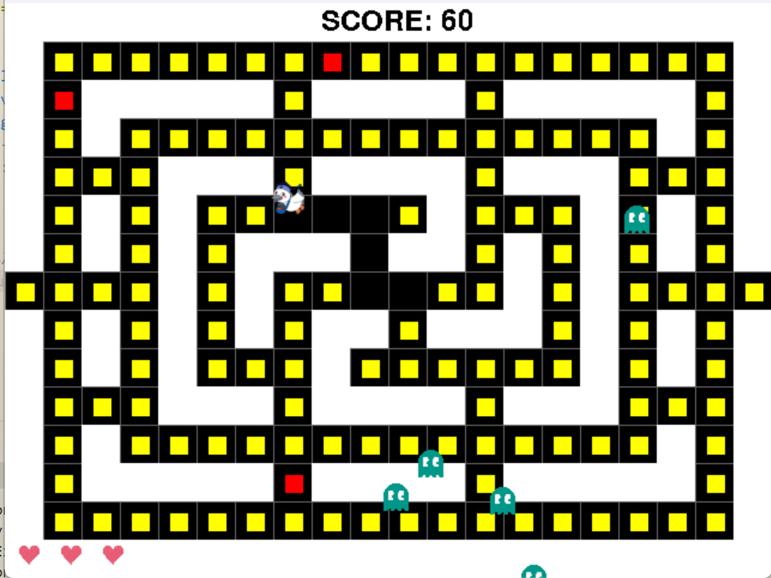

# こうかマン

## 実行環境の必要条件
* python >= 3.10
* pg >= 2.1

## ゲームの概要
* パッ〇マン
* マップに存在する黄色い餌を、ゴーストから逃げながら、全部食べよう！
* 赤いパワー餌を食べると、一定時間敵を食べられるよ。さらに移動速度が上がるよ！
* 餌を食べると10ポイント、無敵状態で敵を食べると50ポイント入るよ！
* 参考URL：[【Python】pgでパックマン風のゲームを作ってみた](https://qiita.com/aramasa_ash/items/f8162190420c8bc9232f )

## ゲームの遊び方
* 矢印キーでこうかとんを操作し、餌を食べよう
* パワー餌を食べると、無敵になってゴーストを倒せるよ
* 全部の餌を食べたらクリア!
* ゴーストに3回当たるか、制限時間が無くなるとGameOver!

## ゲームの実装
### 共通基本機能
* 背景画像
* キャラクター
* 餌

### 分担追加機能
* マップ作成：髙橋 宙
* 敵作成：岡本 雄太
* アイテム（無敵アイテム）：島 快成
* 効果音+BGM：來島　悠空
* スコア：守山　周利
* 残機：竹中　翔太

### ToDo
- [x] マップ作成
- [x] 敵作成
- [x] アイテム（無敵アイテム）
- [x] 効果音+BGM
- [x] スコア
- [x] 残機

### 要修正or機能追加希望
- [x] 敵が復活しない
- [x] 敵のスポーン位置によっては即死する
- [ ] こうかとんと餌の当たり判定が小さい
- [ ] こうかとんと敵の当たり判定が微妙に大きい
- [ ] 壁に対して斜め移動すると移動できない
- [x] 無敵状態、被弾がわかりずらい
- [ ] 横中央の通路でワープできるようにしたい
- [x] 制限時間追加

### 発表前機能追加
* 制限時間追加　ー　初期設定100秒。残り10秒になると表示を赤色にする。時間が0になるとGameOver
* こうかとんの被弾表示　ー　無敵時間分だけ、こうかとんの画像を点滅させる（※被弾後にこうかとんが透明なままになるときがある。要修正）
* 無敵時のゴースト設定　ー　こうかとんが無敵時に、ゴーストの色を変え、スピードを半減させる
* ゴースト数調整機能　ー　ゴーストの数が一定数（基本数5匹）を下回ったなら、一定時間ごとにゴーストの数が一定数になるよう敵を追加。（※ゴーストの発生位置がランダムすぎる＆発生時間がランダムになってしまう）
* ゴーストのスポーン位置を限定　ー　やや中央より外側にゴーストがスポーンするよう調整

 